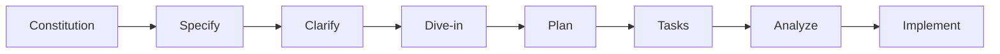

# Speckit Developer Documentation v2.0

**Last Updated**: November 6, 2025  
**Version**: 2.0  
**Target Audience**: Developers, Product Managers, Technical Leads  
**Workflow**: Constitution → Specify → Clarify → Dive-in → Plan → Tasks → Analyze → Implement

---

## Table of Contents

- [Introduction](#introduction)
  - [Why Speckit?](#why-speckit)
  - [When NOT to Use Speckit](#when-not-to-use-speckit)
- [What is Speckit?](#what-is-speckit)
- [Core Concepts](#core-concepts)
- [Installation & Setup](#installation--setup)
- [The Workflow](#the-workflow)
- [Command Reference](#command-reference)
  - [1. Constitution](#1-constitution-speckitconstitution)
  - [2. Specify](#2-specify-speckitspecify)
  - [3. Clarify](#3-clarify-speckitclarify)
  - [4. Dive-in](#4-dive-in-speckitdive-in)
  - [5. Plan](#5-plan-speckitplan)
  - [6. Tasks](#6-tasks-speckittasks)
  - [7. Analyze](#7-analyze-speckitanalyze)
  - [8. Implement](#8-implement-speckitimplement)
- [Best Practices](#best-practices)
- [Examples & Use Cases](#examples--use-cases)
- [Troubleshooting](#troubleshooting)
- [Advanced Topics](#advanced-topics)
- [Quick Reference Card](#quick-reference-card)

---

## Introduction

> **Info**: Speckit is a **specification-driven development workflow** that transforms natural language feature descriptions into fully-planned, implementation-ready development tasks.

### Why Speckit?

| Traditional Problems                                     | Speckit Solutions                                                             |
| -------------------------------------------------------- | ----------------------------------------------------------------------------- |
| Requirements scattered across documents, chats, meetings | **Single source of truth**: All specs, plans, and tasks in `specs/` directory |
| Implementation starts before design complete             | **Progressive refinement**: Each stage builds on previous work                |
| Ambiguities discovered mid-development                   | **Explicit clarifications**: Caught early and resolved systematically         |
| No traceability between requirements and code            | **Full traceability**: Requirements → Plan → Tasks → Code                     |
| Teams unsure if they're building the right thing         | **Constitution-backed**: Features validated against project principles        |

### When NOT to Use Speckit

> **Warning**: Speckit adds structure and rigor. This is valuable for sustainable development, but may be overkill for certain scenarios.

**❌ DO NOT use Speckit for:**

| Scenario                       | Why It's Inappropriate                           | Better Alternative             |
| ------------------------------ | ------------------------------------------------ | ------------------------------ |
| **Bug fixes**                  | No new feature/requirements needed               | Direct fix with git commit     |
| **Hotfixes**                   | Time-critical, needs immediate deployment        | Emergency patch process        |
| **Trivial UI tweaks**          | Change button color, adjust spacing              | Direct edit with code review   |
| **Copy/text updates**          | Change wording, fix typos                        | Direct content update          |
| **Dependency updates**         | Upgrade package versions                         | Standard dependency management |
| **Configuration changes**      | Update environment variables, API keys           | Config management tools        |
| **Refactoring existing code**  | Improving code quality without new functionality | Dedicated refactoring workflow |
| **Exploratory prototypes**     | Quick spike to test feasibility                  | Throwaway prototype branch     |
| **Emergency investigations**   | Debugging production issues                      | Incident response process      |
| **Solo hobby projects**        | Personal learning, no team coordination needed   | Freestyle development          |
| **One-off admin scripts**      | Single-use data migration or cleanup             | Script with inline comments    |
| **Documentation-only updates** | README improvements, API docs                    | Direct documentation editing   |

**When Speckit overhead is too high:**

- **Time pressure**: Less than 1 day to deliver (use rapid prototyping)
- **Trivial scope**: Less than 50 lines of code expected
- **No ambiguity**: Requirements are crystal clear and cannot be misunderstood
- **No integration**: Change is completely isolated with zero dependencies
- **Throwaway work**: Code won't be maintained long-term
- **Learning/training**: Experimenting with new technology

**Speckit is designed for:**

- ✅ **New features** with user-facing functionality
- ✅ **Medium to complex** changes (>1 day of work)
- ✅ **Team collaboration** requiring shared understanding
- ✅ **Long-term maintenance** where traceability matters
- ✅ **Multiple stakeholders** needing alignment
- ✅ **API integrations** requiring contracts and error handling
- ✅ **Cross-cutting concerns** touching multiple system parts

**Decision Rule of Thumb:**

```
If (new_functionality AND user_impact AND >1_day_work) {
    USE SPECKIT
} else if (bug_fix OR config_change OR <50_lines) {
    SKIP SPECKIT - Direct fix
} else {
    EVALUATE: Will documentation and traceability save time later?
}
```

---

## What is Speckit?

Speckit is a collection of **8 interconnected AI commands** that guide you through a complete feature development lifecycle:

```
Constitution → Specify → Clarify → Dive-in → Plan → Tasks → Analyze → Implement
```

### Command Overview

| Command                 | Purpose                               | Output                                                  |
| ----------------------- | ------------------------------------- | ------------------------------------------------------- |
| `/speckit.constitution` | Establish project principles          | `constitution.md`                                       |
| `/speckit.specify`      | Create feature specification          | `spec.md`, `requirements.md`, `progress.md`             |
| `/speckit.clarify`      | Resolve ambiguities (max 5 questions) | Updated `spec.md`                                       |
| `/speckit.dive-in`      | Document backend APIs                 | `dive-in.md`                                            |
| `/speckit.plan`         | Design technical architecture         | `plan.md`, `research.md`, `data-model.md`, `contracts/` |
| `/speckit.tasks`        | Generate implementation tasks         | `tasks.md`                                              |
| `/speckit.analyze`      | Validate consistency (read-only)      | Analysis report                                         |
| `/speckit.implement`    | Execute tasks and build feature       | Source code, updated `tasks.md`                         |

### Key Components

1. **Prompts** (`prompts/`): AI command definitions for your IDE
2. **Templates** (`.specify/templates/`): Structured document templates
3. **Scripts** (`.specify/scripts/`): Helper automation scripts
4. **Memory** (`.specify/memory/`): Project constitution and guidelines
5. **Artifacts** (`specs/###-feature-name/`): Generated specifications and plans

---

## Core Concepts

### Feature Branches

Every feature gets a numbered branch following the pattern: `###-short-descriptive-name`

**Examples**:

- `001-user-authentication`
- `002-payment-processing`
- `003-analytics-dashboard`

> **Tip**: Numbered branches provide traceability, isolation, and easy organization.

### Artifacts

Each feature produces a structured set of documents:

```
specs/001-user-authentication/
├── spec.md              # WHAT to build (business requirements)
├── dive-in.md           # API specifications (backend contracts)
├── plan.md              # HOW to build (technical architecture)
├── research.md          # WHY decisions were made
├── data-model.md        # Data structures and relationships
├── quickstart.md        # Integration guide for developers
├── tasks.md             # Implementation checklist
├── contracts/           # API contracts and schemas
│   ├── auth-api.md
│   └── user-api.md
└── checklists/          # Quality validation checklists
    ├── requirements.md  # Spec quality validation
    ├── progress.md      # Workflow stage tracking
    ├── ux.md            # UX requirements checklist
    └── security.md      # Security requirements checklist
```

### Constitution

The **project constitution** (`.specify/memory/constitution.md`) defines:

- **Architectural principles** (non-negotiable rules)
- **Quality standards** (performance, security, accessibility)
- **Governance processes** (how to make changes)

> **Warning**: All features MUST align with constitutional principles.

### Progress Tracking

Each feature automatically tracks progress through workflow stages:

| Stage           | Status      | Completed  |
| --------------- | ----------- | ---------- |
| 1. Constitution | ✓ Complete  | 2025-11-03 |
| 2. Specify      | ✓ Complete  | 2025-11-04 |
| 3. Clarify      | In Progress | -          |
| 4. Dive-in      | Not started | -          |
| 5. Plan         | Not started | -          |
| 6. Tasks        | Not started | -          |
| 7. Analyze      | Not started | -          |
| 8. Implement    | Not started | -          |

**Quick Stats**: "3/8 stages complete (37.5%)"

---

## Installation & Setup

### Prerequisites

**Required**:

- AI IDE (Cursor, GitHub Copilot, Claude Code, Windsurf, Kilo Code, or Roo Code)
- Git repository initialized
- Project structure with `prompts/` and `.specify/` folders

### Step 1: Install Prompts

Run the setup script from your project root:

```bash
# Auto-detect your IDE and install
./prompts/setup_prompts.sh

# Or specify your IDE explicitly
./prompts/setup_prompts.sh cursor
./prompts/setup_prompts.sh vscode
./prompts/setup_prompts.sh claude
```

**What this does**:

- Detects your IDE environment
- Copies prompt files to the correct location
- Renames files if needed (e.g., `.prompt.md` for VS Code)
- Shows installation summary and next steps

### Step 2: Verify Installation

**For Cursor**:

1. Restart Cursor
2. Open Cursor chat (Cmd+L or Ctrl+L)
3. Type `/speckit.` - you should see autocomplete suggestions

**For VS Code (GitHub Copilot)**:

1. Restart VS Code
2. Open Copilot chat
3. Type `@workspace /speckit.` - you should see available commands

**For Claude Code**:

1. Restart Claude Code
2. Type `/speckit.` in chat - commands should appear

### Step 3: Verify Project Structure

```bash
ls -la .specify/
# Should see: memory/, scripts/, templates/

ls -la .specify/memory/
# Should see: constitution.md

ls -la .specify/templates/
# Should see: spec-template.md, plan-template.md, tasks-template.md, etc.
```

### Step 4: Initialize Constitution

If your project doesn't have a constitution:

```bash
/speckit.constitution
```

Answer the questions to establish project principles.

---

## The Workflow

### Overview: 8 Stages



| Stage           | What It Does                      | Required?              | When to Skip           |
| --------------- | --------------------------------- | ---------------------- | ---------------------- |
| 1. Constitution | Define project principles         | Yes (once per project) | Constitution exists    |
| 2. Specify      | Create feature specification      | Yes (every feature)    | Never                  |
| 3. Clarify      | Resolve ambiguities               | Recommended            | Spec is crystal clear  |
| 4. Dive-in      | Document API specifications       | Optional               | No backend API changes |
| 5. Plan         | Design technical architecture     | Yes (every feature)    | Never                  |
| 6. Tasks        | Generate implementation checklist | Yes (every feature)    | Never                  |
| 7. Analyze      | Validate consistency              | Recommended            | Time-constrained       |
| 8. Implement    | Execute tasks and build           | Yes (every feature)    | Never                  |

### Stage Dependencies

```
constitution (required)
    ↓
specify (required)
    ↓
clarify (recommended) ← Can iterate if needed
    ↓
dive-in (optional) ← For features with backend APIs
    ↓
plan (required)
    ↓
tasks (required)
    ↓
analyze (recommended) ← Quality gate before implementation
    ↓
implement (required)
```

**Workflow Paths**:

- **Required**: constitution → specify → plan → tasks → implement
- **Recommended**: + clarify + analyze
- **Full**: All 8 stages (best for complex features)

---

## Command Reference

### 1. Constitution: `/speckit.constitution`

> **Purpose**: Establish or update project architectural principles.

#### When to Run

- Once at project start
- When architectural principles change
- When adding major new principles

#### What It Does

1. Checks current git branch (creates/switches to feature branch if needed)
2. Loads existing constitution template
3. Collects values for project-specific principles
4. Updates `.specify/memory/constitution.md`
5. Creates initial progress report

#### Usage

```bash
# Interactive mode (asks questions)
/speckit.constitution

# With partial updates
/speckit.constitution Update Principle III to use Redux instead of Zustand
```

#### Example Questions

- Project name? `portal_loyalty`
- Principle 1 name? `Feature-Scoped Modularity`
- Principle 1 description? `Each feature must be self-contained...`
- Ratification date? `2025-11-03`

#### Output

- `.specify/memory/constitution.md` (updated)
- `specs/###-feature/checklists/progress.md` (if on feature branch)
- Sync impact report (prepended as comment)

#### Example Constitution Section

```markdown
### Principle I: Feature-Scoped Modularity

**Statement**: Each feature MUST be organized as a self-contained
module with clear boundaries, minimizing cross-feature dependencies.

**Rules**:

- Features organized under `src/pages/[FeatureName]/`
- Shared functionality in `src/components/` or `src/apis/`
- Each feature has single entry point component

**Rationale**: Enables parallel development and prevents regressions.
```

---

### 2. Specify: `/speckit.specify`

> **Purpose**: Create a business-focused feature specification from natural language description.

#### When to Run

- Starting a new feature
- Updating feature requirements

#### What It Does

1. Generates short feature name (e.g., "user-auth")
2. Finds next available feature number
3. Creates/checks out feature branch (e.g., `001-user-auth`)
4. Creates spec directory structure
5. Generates `spec.md` with user stories and requirements
6. Creates requirements quality checklist
7. Validates specification completeness
8. Resolves [NEEDS CLARIFICATION] markers (max 3)

#### Usage

```bash
# Provide feature description
/speckit.specify Add user authentication with email/password login,
password reset, and remember me functionality

# With more context
/speckit.specify Create a cashback management tool that allows operators
to view, filter, and export cashback transaction records with status tracking
```

#### Good vs Poor Descriptions

| ✅ Good Descriptions                                                | ❌ Poor Descriptions             |
| ------------------------------------------------------------------- | -------------------------------- |
| "Add OAuth2 login for enterprise SSO integration"                   | "Make it better" (too vague)     |
| "Create analytics dashboard showing DAU, conversion rates, revenue" | "Add a button" (too trivial)     |
| "Implement file upload with drag-drop, progress, validation"        | "Fix everything" (not a feature) |

#### Clarification Flow Example

```markdown
## Question 1: Authentication Method

**Recommended:** Option B - Email/Password + OAuth2

| Option | Description             | Implications               |
| ------ | ----------------------- | -------------------------- |
| A      | Email/Password only     | Simple but limited         |
| B      | Email/Password + OAuth2 | Flexible for enterprise    |
| C      | OAuth2 only             | Requires external provider |

**Your choice**: _User responds with "B" or "recommended"_
```

#### Output

- Feature branch: `###-feature-name`
- `specs/###-feature-name/spec.md`
- `specs/###-feature-name/checklists/requirements.md`
- `specs/###-feature-name/checklists/progress.md`

#### spec.md Sections

- **User Scenarios & Testing** (with priorities P0, P1, P2...)
- **Requirements** (Functional + Non-Functional)
- **Success Criteria** (measurable outcomes)
- **Key Entities** (if data involved)
- **Constitution Alignment** (validation against principles)

> **Warning**: User Story 0 (US0) is MANDATORY for navigation/menu access. Required by Constitution Principle VII.

---

### 3. Clarify: `/speckit.clarify`

> **Purpose**: Identify and resolve ambiguities in the specification through targeted questions (max 5).

#### When to Run

- After `/speckit.specify` if spec has ambiguities
- Before `/speckit.plan` to reduce rework risk
- When requirements feel unclear

#### What It Does

1. Loads feature spec and runs structured ambiguity scan
2. Analyzes 11 categories (functional scope, data model, UX flow, etc.)
3. Generates prioritized question queue (max 5 questions)
4. Asks questions ONE AT A TIME with recommended answers
5. Updates spec immediately after each accepted answer
6. Records clarifications in `## Clarifications` section
7. Updates progress report

#### Ambiguity Categories Scanned

| Category                      | What It Checks                                         |
| ----------------------------- | ------------------------------------------------------ |
| Functional Scope & Behavior   | Core goals, out-of-scope items, user roles             |
| Domain & Data Model           | Entities, attributes, relationships, state transitions |
| Interaction & UX Flow         | User journeys, error states, accessibility             |
| Non-Functional Attributes     | Performance, scalability, reliability, security        |
| Integration & Dependencies    | External services, data formats, protocols             |
| Edge Cases & Failure Handling | Negative scenarios, rate limiting, conflict resolution |
| Constraints & Tradeoffs       | Technical constraints, alternatives rejected           |
| Terminology & Consistency     | Canonical terms, deprecated terminology                |
| Completion Signals            | Acceptance criteria testability                        |
| Placeholders                  | TODO markers, ambiguous adjectives                     |

#### Usage

```bash
# Interactive mode
/speckit.clarify

# With context (optional)
/speckit.clarify Focus on security and data validation requirements
```

#### Example Question Flow

```markdown
**Question 1: Data Retention Policy**

**Suggested:** 90 days - Standard industry practice for user activity data

Format: Short answer (<=5 words)

**Your answer**: You can accept the suggestion by saying "yes" or
"suggested", or provide your own answer.

_User responds: "180 days for compliance"_

✓ Recorded. Updating spec...

**Question 2: Error Notification Method**

**Recommended:** Option B - Toast notifications

| Option | Description                        |
| ------ | ---------------------------------- |
| A      | Alert dialogs (blocking)           |
| B      | Toast notifications (non-blocking) |
| C      | Inline error messages only         |

_User responds: "B" or "recommended"_

✓ Recorded. Updating spec...
```

#### How Answers Are Integrated

```markdown
## Clarifications

### Session 2025-11-06

- Q: Data retention policy for user activity logs → A: 180 days for compliance
- Q: Error notification method for failed operations → A: Toast notifications (non-blocking)

[Then respective sections in spec are updated with these decisions]
```

#### Rules

- Maximum 5 questions total per session
- Questions presented one at a time (never all at once)
- Each question has recommended/suggested answer
- User can accept recommendation or provide custom answer
- Spec updated immediately after each answer
- No duplicate questions across sessions

#### Output

- Updated `specs/###-feature-name/spec.md` (with clarifications integrated)
- Updated progress report (Stage 3: Clarify marked complete)

---

### 4. Dive-in: `/speckit.dive-in`

> **Purpose**: Create comprehensive backend API specification with endpoints, schemas, and integration requirements.

#### When to Run

- For features requiring backend API integration
- When detailed API documentation is needed
- Before frontend and backend team separation

#### When to Skip

- Purely frontend features (no backend changes)
- Features using only existing APIs

#### What It Does

1. Validates feature branch context
2. **REQUIRES backend API specification** (from Confluence URL or direct input)
3. Uses MCP (Model Context Protocol) to fetch Confluence content if URL provided
4. Generates comprehensive API documentation
5. Creates frontend integration checklist
6. Updates progress report

#### Usage

```bash
# With Confluence URL
/speckit.dive-in https://yourorg.atlassian.net/wiki/spaces/ENG/pages/12345/Cashback+API

# With direct specification
/speckit.dive-in The API has these endpoints:
- GET /api/cashbacks (list with pagination)
- GET /api/cashbacks/:id (details)
- POST /api/cashbacks/export (CSV export)
[...provide endpoint details, schemas, etc.]

# Skip (creates blank template - not recommended)
/speckit.dive-in skip
```

#### Required Information

Will ask if not provided:

- Feature name and ticket ID
- Core resources/entities being managed
- Status definitions for each entity
- Endpoint structure and authentication
- Data models and relationships
- File upload/download operations (if any)
- External service integrations

#### dive-in.md Sections

| Section            | Content                                     |
| ------------------ | ------------------------------------------- |
| Overview           | Feature description and links               |
| Status Definitions | Tables for each entity                      |
| API Endpoints      | Base URLs, auth, endpoint details           |
| Common Patterns    | List, create, update, delete, export        |
| Data Models        | TypeScript interfaces, database schemas     |
| Error Responses    | All HTTP codes with examples                |
| State Transitions  | Status flow diagrams                        |
| Integration Notes  | Dependencies, async processing, constraints |
| Frontend Checklist | Actionable TODO list                        |

#### Example API Endpoint Documentation

````markdown
### GET /api/cashbacks

**Description**: List cashback transactions with pagination and filtering

**Authentication**: Required (Bearer token, `evo_operator` role)

**Query Parameters**:

- `page_id` (number, default: 1): Page number
- `per_page` (number, default: 20, max: 100): Items per page
- `status` (string, optional): Filter by status (init, processing, done, failed)
- `search` (string, optional): Search by transaction ID or user ID

**Success Response (200)**:

```json
{
  "data": [
    {
      "id": "cb_12345",
      "user_id": "user_67890",
      "amount": 50000,
      "status": "done",
      "created_at": "2025-11-06T10:00:00Z"
    }
  ],
  "meta": {
    "page": 1,
    "per_page": 20,
    "total": 150
  }
}
```
````

**Error Responses**:

- 401: Unauthorized (invalid token)
- 403: Forbidden (insufficient permissions)
- 422: Validation error (invalid parameters)

````

#### Output
- `specs/###-feature-name/dive-in.md` (complete API specification)
- Updated progress report (Stage 4: Dive-In marked complete)
- Documents API specification source (Confluence URL or Direct Input)

#### Quality Validation
- All endpoints have complete request/response schemas
- All statuses are defined and explained
- State transitions are documented
- Data models include all fields with types
- Error responses cover all HTTP codes
- Frontend checklist is comprehensive

---

### 5. Plan: `/speckit.plan`

> **Purpose**: Generate technical implementation plan with architecture, data models, and API contracts.

#### When to Run
- After spec is finalized (and clarified if needed)
- After dive-in (if backend APIs involved)
- Before task generation

#### What It Does

**Phase 0 - Research**:
1. Identifies unknowns from spec (NEEDS CLARIFICATION markers)
2. Generates `research.md` with decisions and rationale
3. Resolves all technical uncertainties

**Phase 1 - Design & Contracts**:
1. Reads `ARCHITECTURE.md` for project patterns and conventions
2. Generates `data-model.md` (entities, fields, relationships)
3. Generates API contracts in `contracts/` folder (as `.md` or `.js` files)
4. Maps dive-in API endpoints to frontend API manager functions
5. Creates `quickstart.md` (implementation guide)
6. Updates agent context files (Copilot, Cursor, etc.)
7. Re-evaluates constitution alignment

#### Usage

```bash
# Standard usage
/speckit.plan

# With focus areas
/speckit.plan Focus on data model and API integration patterns
````

#### NEW vs REFACTOR Determination

> **Info**: By default, planning assumes **creating NEW standalone features**.

**Default behavior**:

- NEW files and components
- NEW reusable infrastructure
- Demo/reference implementations (not refactoring existing code)

**Only plans refactors if**:

- Explicitly requested in spec: "Refactor Campaign list to use new pattern"
- User input states: "This is a refactor of existing feature X"

> **Tip**: This prevents unintended changes to working features and reduces regression risk.

#### plan.md Sections

| Section             | Content                                            |
| ------------------- | -------------------------------------------------- |
| Summary             | Primary requirement + technical approach           |
| Technical Context   | Language, dependencies, platform, constraints      |
| Constitution Check  | Validation against all principles                  |
| Project Structure   | Documentation + source code layout                 |
| Complexity Tracking | Only if constitution violations need justification |

#### data-model.md Example

```markdown
# Data Model: Cashback Management

## Entities

### Cashback

**Description**: Represents a cashback transaction record

**Fields**:

- `id` (string, PK): Unique identifier (e.g., "cb_12345")
- `user_id` (string, FK → User): Associated user
- `amount` (number): Cashback amount in currency units
- `status` (enum): Transaction status (init, processing, done, failed)
- `created_at` (datetime): Creation timestamp
- `updated_at` (datetime): Last modification timestamp
- `metadata` (json): Additional transaction data

**Relationships**:

- BelongsTo User (via user_id)
- HasMany CashbackEvents (transaction history)

**Validation Rules**:

- amount must be positive
- status must be valid enum value
- user_id must reference existing user
```

#### contracts/ Structure

```
contracts/
├── cashback-api.md        # Cashback endpoint contracts
├── user-api.md            # User endpoint contracts
└── export-api.md          # Export functionality contracts
```

#### Output

- `specs/###-feature-name/plan.md`
- `specs/###-feature-name/research.md`
- `specs/###-feature-name/data-model.md`
- `specs/###-feature-name/quickstart.md`
- `specs/###-feature-name/contracts/*.md` (or `.js`)
- Updated agent context files
- Updated progress report (Stage 5: Plan marked complete)

---

### 6. Tasks: `/speckit.tasks`

> **Purpose**: Generate actionable, dependency-ordered implementation tasks organized by user story.

#### When to Run

- After `/speckit.plan` completes
- Before implementation begins

#### What It Does

1. Loads plan, spec, data-model, contracts, research, quickstart
2. Extracts user stories with priorities (P0, P1, P2, P3...)
3. Maps entities, endpoints, and requirements to user stories
4. Generates task breakdown organized by user story
5. Creates dependency graph and parallel execution guidance
6. Validates each user story is independently testable
7. Updates progress report

#### Usage

```bash
# Standard usage
/speckit.tasks

# With specific focus
/speckit.tasks Focus on User Story 1 and 2 only (MVP scope)
```

#### Task Format (STRICT)

```markdown
- [ ] [TaskID][p?] [Story?] Description with file path
```

**Components**:

- `[ ]` - Checkbox (markdown)
- `T001` - Sequential task ID
- `[P]` - Parallel marker (optional, for different files/no dependencies)
- `[US1]` - User story label (required for story phases)
- Description - Clear action with exact file path

#### Examples

| Status     | Example                                                                          |
| ---------- | -------------------------------------------------------------------------------- |
| ✅ CORRECT | `- [ ] T001 Create project structure per implementation plan`                    |
| ✅ CORRECT | `- [ ] T005 [P] Create authentication middleware in src/middleware/auth.py`      |
| ✅ CORRECT | `- [ ] T012 [P] [US1] Create User model in src/models/user.py`                   |
| ✅ CORRECT | `- [ ] T020 [US2] Implement CashbackService in src/services/cashback_service.py` |
| ❌ WRONG   | `- [ ] Create User model` (missing ID and file path)                             |
| ❌ WRONG   | `T001 [US1] Create model` (missing checkbox)                                     |
| ❌ WRONG   | `- [ ] [US1] Create User model` (missing Task ID)                                |

#### Task Organization (by User Story)

```markdown
## Phase 1: Setup (Shared Infrastructure)

- [ ] T001 Create project structure per implementation plan
- [ ] T002 Initialize dependencies with package manager
- [ ] T003 [P] Configure linting and formatting tools

---

## Phase 2: Foundational (Blocking Prerequisites)

**⚠️ CRITICAL**: No user story work can begin until this phase is complete

- [ ] T004 Setup database schema and migrations framework
- [ ] T005 [P] Implement authentication/authorization framework
- [ ] T006 [P] Setup API routing and middleware structure

**Checkpoint**: Foundation ready - user story implementation can now begin

---

## Phase 3: User Story 0 - Navigation Access (Priority: P0 - Prerequisite)

**Goal**: Enable users to discover and access feature through portal navigation

**Independent Test**: Login, verify menu item appears, click to reach feature

- [ ] T010 [US0] Add route configuration in src/routes.js
- [ ] T011 [US0] Add permission definition in src/constant/permissions.js
- [ ] T012 [US0] Add permission check in src/routePermissions.js
- [ ] T013 [US0] Add menu item to sidebar navigation with permission check
- [ ] T014 [US0] Create feature landing page component (minimal for now)

**Checkpoint**: Feature now accessible through portal UI

---

## Phase 4: User Story 1 - List Cashback Transactions (Priority: P1)

**Goal**: Users can view and filter cashback transactions

**Independent Test**: Navigate to Cashback Tool, see transaction list with filters

- [ ] T015 [P][us1] Create Cashback model in src/models/cashback.js
- [ ] T016 [P][us1] Create Transaction model in src/models/transaction.js
- [ ] T017 [US1] Implement CashbackService in src/services/cashbackService.js
- [ ] T018 [US1] Create CashbackList component in src/pages/CashbackTool/List.js
- [ ] T019 [US1] Add filtering and search functionality
- [ ] T020 [US1] Add pagination controls

**Checkpoint**: User Story 1 fully functional and independently testable
```

#### Implementation Strategy

```markdown
### MVP First (US0 + US1 Only)

1. Complete Setup + Foundational
2. Complete Navigation (US0) - REQUIRED
3. Complete US1
4. STOP and VALIDATE
5. Deploy/demo if ready

### Incremental Delivery

1. Setup + Foundational → Foundation ready
2. US0 (Navigation) → Feature accessible
3. US1 → Deploy/Demo (MVP!)
4. US2 → Deploy/Demo
5. US3 → Deploy/Demo
```

#### Output

- `specs/###-feature-name/tasks.md` (complete task breakdown)
- Updated progress report (Stage 6: Tasks marked complete)
- Summary: total tasks, tasks per story, parallel opportunities

---

### 7. Analyze: `/speckit.analyze`

> **Purpose**: Perform read-only consistency and quality analysis across spec.md, plan.md, and tasks.md.

> **Warning**: STRICTLY READ-ONLY - Does NOT modify any files automatically.

#### When to Run

- After `/speckit.tasks` generates tasks.md
- Before `/speckit.implement` begins
- As a quality gate before code review

#### What It Does

1. Loads spec, plan, tasks, and constitution
2. Builds semantic models of requirements, stories, and tasks
3. Runs detection passes for 6 categories of issues
4. Assigns severity (CRITICAL, HIGH, MEDIUM, LOW)
5. Generates compact analysis report
6. Updates progress report
7. Offers remediation suggestions (user must approve before applying)

#### Detection Passes (6 Categories)

| Category                  | What It Detects                                                       |
| ------------------------- | --------------------------------------------------------------------- |
| 1. Duplication            | Near-duplicate requirements, redundant phrasing                       |
| 2. Ambiguity              | Vague adjectives without metrics, unresolved placeholders             |
| 3. Underspecification     | Requirements missing outcomes, tasks referencing undefined components |
| 4. Constitution Alignment | Requirements/plan conflicting with MUST principles                    |
| 5. Coverage Gaps          | Requirements with zero tasks, tasks with no requirement mapping       |
| 6. Inconsistency          | Terminology drift, entity mismatches, task ordering contradictions    |

#### Severity Assignment

| Severity     | Criteria                                                                          |
| ------------ | --------------------------------------------------------------------------------- |
| **CRITICAL** | Violates constitution MUST, missing core artifact, requirement with zero coverage |
| **HIGH**     | Duplicate/conflicting requirement, ambiguous security/performance attribute       |
| **MEDIUM**   | Terminology drift, missing non-functional task coverage                           |
| **LOW**      | Style/wording improvements, minor redundancy                                      |

#### Example Analysis Report

```markdown
## Specification Analysis Report

| ID  | Category      | Severity | Location(s)  | Summary                                       | Recommendation                    |
| --- | ------------- | -------- | ------------ | --------------------------------------------- | --------------------------------- |
| A1  | Ambiguity     | HIGH     | spec.md:L45  | "Fast loading" not quantified                 | Add specific metric: "<3 seconds" |
| C1  | Coverage      | MEDIUM   | spec.md:L67  | FR-007 has no implementing tasks              | Add task for password reset flow  |
| D1  | Constitution  | CRITICAL | plan.md:L120 | Violates Principle II - no API error handling | Add error handling to API client  |
| E1  | Inconsistency | MEDIUM   | Multiple     | "User" vs "Customer" terminology drift        | Standardize on "User" throughout  |

### Metrics

- Total Requirements: 15
- Total Tasks: 42
- Coverage: 87% (13/15 requirements have tasks)
- Ambiguity Count: 3
- Duplication Count: 1
- Critical Issues: 1
```

#### Output

- Analysis report (displayed in conversation, NOT written to file)
- Updated progress report (Stage 7: Analyze marked complete)
- Blockers set based on findings (CRITICAL issues block implementation)
- Next recommended command based on findings

> **Info**: Constitution violations are automatically CRITICAL and require adjustment of spec/plan/tasks.

---

### 8. Implement: `/speckit.implement`

> **Purpose**: Execute implementation plan by processing all tasks in tasks.md.

#### When to Run

- After `/speckit.analyze` passes (or issues resolved)
- When tasks.md is complete and validated
- Ready to write code

#### What It Does

**Pre-Implementation**:

1. Checks checklist status (if checklists exist)
2. If checklists incomplete: STOPS and asks for confirmation
3. If checklists complete or user confirms: Proceeds

**Implementation**:

1. Loads all design documents
2. Parses task structure (phases, dependencies, parallel markers)
3. **Analyzes feature scope** (core feature vs extensions)
4. If extension phases found: STOPS and shows scope warning
5. Executes tasks phase-by-phase respecting dependencies
6. Creates/verifies ignore files
7. Reports progress after each task
8. Marks completed tasks as [x] in tasks.md
9. Handles errors appropriately
10. Updates progress report

#### Usage

```bash
# Standard usage (executes all tasks)
/speckit.implement

# With scope limitation
/speckit.implement Only implement core feature phases (Phase 1-6)
```

#### Checklist Validation

If `specs/###-feature-name/checklists/` exists:

| Checklist   | Total | Completed | Incomplete | Status |
| ----------- | ----- | --------- | ---------- | ------ |
| ux.md       | 12    | 12        | 0          | ✓ PASS |
| test.md     | 8     | 5         | 3          | ✗ FAIL |
| security.md | 6     | 6         | 0          | ✓ PASS |

> **Warning**: Some checklists are incomplete. Do you want to proceed with implementation anyway? (yes/no)

#### Scope Warning

```markdown
⚠️ SCOPE WARNING

This tasks.md includes phases that extend the framework to OTHER features:

- Phase 7: Offers Extension
- Phase 8: Merchants Extension

Current feature scope: Phases 1-6 (Cashback Tool core feature)
Extension phases: Phases 7-8 (Apply pattern to other features)

Options:

1. Implement ONLY core feature phases [1-6](RECOMMENDED)
2. Implement core + specific extensions (specify which)
3. Implement everything (NOT RECOMMENDED - may break existing features)

What would you like to do?
```

> **Tip**: Default to Option 1 (core feature only) for safer implementation with no regression risk.

#### Execution Rules

| Phase            | What Happens                                      |
| ---------------- | ------------------------------------------------- |
| Setup            | Initialize structure, dependencies, configuration |
| Foundational     | Blocking prerequisites before any user story      |
| Navigation (US0) | Menu/routing integration (MANDATORY)              |
| User Stories     | Models → Services → Endpoints/UI                  |
| Integration      | Database, middleware, logging, external services  |
| Polish           | Validation, optimization, documentation           |

#### Output

- Updated `specs/###-feature-name/tasks.md` (tasks marked [x] as complete)
- Updated progress report (Stage 8: Implement)
- Source code files (per tasks)
- Implementation summary report

---

## Best Practices

### General Workflow

| ✅ DO                               | ❌ DON'T                                  |
| ----------------------------------- | ----------------------------------------- |
| Always start with Constitution      | Skip Specify (every feature needs a spec) |
| Use Clarify liberally               | Leave [NEEDS CLARIFICATION] markers       |
| Run Analyze before Implement        | Skip constitution checks                  |
| Implement incrementally (MVP first) | Try to build everything at once           |
| Complete User Story 0 + 1 first     | Forget navigation implementation          |

### Writing Specifications

| ✅ DO                                   | ❌ DON'T                               |
| --------------------------------------- | -------------------------------------- |
| Focus on WHAT and WHY, not HOW          | Include implementation details         |
| Write for non-technical stakeholders    | Use vague terms without quantification |
| Use measurable success criteria         | Mix multiple features in one spec      |
| Prioritize user stories (P0, P1, P2...) | Forget edge cases and error scenarios  |
| Make each story independently testable  | Skip constitution alignment            |
| Include User Story 0 for navigation     | Plan features that can't be accessed   |

### Planning Implementation

| ✅ DO                                       | ❌ DON'T                                     |
| ------------------------------------------- | -------------------------------------------- |
| Read ARCHITECTURE.md first                  | Plan refactors without explicit request      |
| Follow existing conventions                 | Introduce new patterns without justification |
| Document decisions in research.md           | Leave NEEDS CLARIFICATION unresolved         |
| Default to NEW standalone features          | Force framework adoption on existing code    |
| Mark file changes clearly (NEW vs EXISTING) | Skip constitution checks                     |

### Generating Tasks

| ✅ DO                             | ❌ DON'T                                  |
| --------------------------------- | ----------------------------------------- |
| Organize by user story            | Create vague tasks ("improve UX")         |
| Use strict format with file paths | Forget file paths in descriptions         |
| Mark parallel tasks with [P]      | Create same-file conflicts in parallel    |
| Define independent test criteria  | Skip User Story 0 (navigation)            |
| Start with MVP scope (US0 + US1)  | Make user stories dependent on each other |
| Include foundational phase        | Include refactor tasks for other features |

---

## Examples & Use Cases

### Example 1: Simple Feature (Read-Only UI)

**Feature**: Display user profile information

**Workflow**:

| Step | Command                                                                       | Output                                    |
| ---- | ----------------------------------------------------------------------------- | ----------------------------------------- |
| 1    | `/speckit.constitution`                                                       | Establishes principles (if first feature) |
| 2    | `/speckit.specify Show user profile with name, email, avatar, account status` | Creates spec                              |
| 3    | `/speckit.clarify`                                                            | No questions needed (simple feature)      |
| 4    | `/speckit.dive-in`                                                            | SKIPPED - No backend changes              |
| 5    | `/speckit.plan`                                                               | Generates technical plan                  |
| 6    | `/speckit.tasks`                                                              | Creates task breakdown                    |
| 7    | `/speckit.analyze`                                                            | Validates consistency                     |
| 8    | `/speckit.implement`                                                          | Builds the feature                        |

**Time estimate**: 2-4 hours for complete workflow

---

### Example 2: Complex Feature (CRUD with Backend)

**Feature**: Cashback management tool with list, filter, export

**Workflow**:

1. `/speckit.constitution` → Establishes principles (if needed)
2. `/speckit.specify Create cashback management tool...` → Creates spec
3. `/speckit.clarify` → Resolves 3 ambiguities
4. `/speckit.dive-in [Confluence URL]` → Documents API specification
5. `/speckit.plan` → Generates architecture, data models, contracts
6. `/speckit.tasks` → Creates 45 tasks across 6 user stories
7. `/speckit.analyze` → Finds 1 CRITICAL issue, fix and re-analyze
8. `/speckit.implement` → Executes tasks

**Time estimate**: 1-2 days for workflow, 2-5 days for implementation

**Deliverables**:

- Complete spec suite (spec, dive-in, plan, research, data-model, contracts, quickstart, tasks)
- Checklists (requirements, progress, ux, security)
- Source code (15+ files)

---

### Example 3: Framework/Infrastructure Feature

**Feature**: Reusable data table component with sorting, filtering, pagination

**Key Principle**: Create NEW component, don't refactor existing features

**Workflow**:

1. `/speckit.specify Create reusable EntityList component framework...`

   - Spec emphasizes: NEW component, demo implementation, opt-in usage
   - No modifications to existing Campaign, Merchant lists

2. `/speckit.plan`

   - Plans NEW component in `src/components/EntityList/`
   - Demo page in `src/pages/Demo/EntityList/`
   - Documentation for future adoption
   - **EXPLICITLY STATES**: No existing feature modifications

3. `/speckit.tasks`

   - Phase 1-4: Building NEW component
   - Phase 5: Creating DEMO page
   - Phase 6: Documentation
   - **NO extension phases**

4. `/speckit.implement`
   - Builds component, demo, and docs
   - Doesn't touch existing features (no regression risk)

**Result**:

- New reusable component available for future
- Demo showing usage
- Existing features unchanged
- Future features can opt-in

---

## Troubleshooting

### Installation Issues

#### Commands not appearing in IDE

**Solutions**:

1. Restart IDE after running setup script
2. Verify prompt files copied to correct location
3. Check IDE version supports custom prompts
4. Try manual setup

```bash
# Manual setup for Cursor
mkdir -p .claude/commands
cp prompts/*.md .claude/commands/
# Restart Cursor
```

---

#### Setup script fails with "Could not detect IDE"

**Solutions**:

1. Specify IDE explicitly: `./prompts/setup_prompts.sh cursor`
2. Check you're running from project root
3. Verify IDE is actually running
4. Check environment variables: `echo $VSCODE_PID` or `echo $CURSOR_PID`

---

### Workflow Issues

#### `/speckit.specify` asks too many questions

**Solutions**:

- Provide more detail in feature description upfront
- Accept default/recommended answers if unsure
- Clarifications are limited to max 3 questions (by design)

---

#### `/speckit.plan` creates refactor tasks for existing features

> **Warning**: This should NOT happen by default

**Solutions**:

1. Check spec.md - does it explicitly request refactoring?
2. Update spec to clarify: "Create NEW component (do not modify existing)"
3. Regenerate plan: `/speckit.plan Create NEW standalone feature`
4. Review plan.md Project Structure section for "NEW" vs "REFACTOR" markers

---

#### `/speckit.implement` scope warning appears

> **Info**: This is a FEATURE, not a bug - protecting existing code

**Understanding**:

- **Core feature phases**: Build YOUR new feature
- **Extension phases**: Modify OTHER existing features
- **Default**: Only implement core (safest)

**Choose wisely**:

- Option 1: Core feature only ← **RECOMMENDED**
- Option 2: Core + specific extensions (specify which)
- Option 3: Everything ← Avoid unless intentional refactoring

---

### Feature-Specific Issues

#### Navigation menu item not appearing

**Checklist**:

1. ☐ Was Phase 3 (US0) completed?
2. ☐ Route added to `src/routes.js`?
3. ☐ Permission check in `src/routePermissions.js`?
4. ☐ Menu item added with permission check?
5. ☐ User role has required permission?

---

#### Constitution alignment failing

> **Info**: Constitution violations should be taken seriously

**Fix pattern**:

```markdown
### Principle II: Contract-Safe API Integrations

⚠️ **NEEDS ATTENTION**: Feature makes direct fetch() calls from components

**Fix**:

- Create `src/apis/cashbackManager.js` with wrapped API calls
- Move all API logic from components to API manager
- Add error handling and configuration
```

---

## Advanced Topics

### Custom Checklists

Use `/speckit.checklist` to create domain-specific quality checklists:

```bash
# UX requirements checklist
/speckit.checklist Create UX checklist focusing on accessibility,
responsive layouts, and visual hierarchy

# Security requirements checklist
/speckit.checklist Create security checklist focusing on authentication,
authorization, data protection, and input validation
```

> **Info**: Checklists are "unit tests for requirements" - they test if REQUIREMENTS are well-written, not if code works.

**Common checklist types**:

| Checklist        | Focus Area                           |
| ---------------- | ------------------------------------ |
| `ux.md`          | User experience requirements quality |
| `api.md`         | API specification completeness       |
| `security.md`    | Security requirements coverage       |
| `performance.md` | Performance criteria clarity         |
| `test.md`        | Test scenario completeness           |

---

### Multi-Feature Projects

**Strategy 1: Sequential** (recommended for small teams)

```
Feature 1 (complete all 8 stages) → Deploy/Test
  ↓
Feature 2 (complete all 8 stages) → Deploy/Test
  ↓
Feature 3 (complete all 8 stages) → Deploy/Test
```

**Strategy 2: Parallel** (for larger teams)

```
Constitution (shared)
  ↓
├── Feature 1 (Dev A): specify → clarify → plan → tasks → implement
├── Feature 2 (Dev B): specify → clarify → plan → tasks → implement
└── Feature 3 (Dev C): specify → clarify → plan → tasks → implement
```

---

### Constitution Evolution

**When to update**:

- Adding new architectural principle
- Changing existing principle
- Technology stack changes
- Team learns better patterns

**Amendment process**:

1. Propose change with rationale
2. Get team consensus
3. Run `/speckit.constitution` with updates
4. Review Sync Impact Report
5. Update dependent templates
6. Review existing features for compliance

**Version bumping**:

| Type  | Example       | When                                 |
| ----- | ------------- | ------------------------------------ |
| MAJOR | 1.0.0 → 2.0.0 | Breaking changes, removed principles |
| MINOR | 1.0.0 → 1.1.0 | New principles added                 |
| PATCH | 1.0.0 → 1.0.1 | Clarifications, typo fixes           |

---

## Quick Reference Card

```
┌─────────────────────────────────────────────────────────────┐
│ Speckit Command Cheat Sheet                                  │
├─────────────────────────────────────────────────────────────┤
│ /speckit.constitution    │ Setup project principles          │
│ /speckit.specify        │ Create feature spec (WHAT)        │
│ /speckit.clarify        │ Resolve ambiguities (max 5 Q's)   │
│ /speckit.dive-in        │ Document backend APIs             │
│ /speckit.plan           │ Design architecture (HOW)         │
│ /speckit.tasks          │ Generate implementation tasks     │
│ /speckit.analyze        │ Validate consistency (read-only)  │
│ /speckit.implement      │ Execute tasks and build feature   │
│ /speckit.checklist      │ Create quality checklist          │
├─────────────────────────────────────────────────────────────┤
│ Setup: ./prompts/setup_prompts.sh [ide]                      │
│ Restart IDE after setup                                       │
├─────────────────────────────────────────────────────────────┤
│ Workflow: constitution → specify → clarify → dive-in →       │
│           plan → tasks → analyze → implement                  │
├─────────────────────────────────────────────────────────────┤
│ Key Files:                                                    │
│   .specify/memory/constitution.md    - Principles            │
│   specs/###-feature-name/spec.md     - WHAT to build         │
│   specs/###-feature-name/plan.md     - HOW to build          │
│   specs/###-feature-name/tasks.md    - Implementation list   │
│   specs/###-feature-name/progress.md - Stage tracking        │
└─────────────────────────────────────────────────────────────┘
```

---

## Summary

Speckit transforms feature development from ad-hoc to systematic:

| Before Speckit                  | With Speckit                   |
| ------------------------------- | ------------------------------ |
| ❌ Requirements scattered       | ✅ Single source of truth      |
| ❌ Implementation before design | ✅ Progressive refinement      |
| ❌ Late ambiguity discovery     | ✅ Early resolution            |
| ❌ No traceability              | ✅ Full traceability           |
| ❌ Inconsistent quality         | ✅ Constitution-backed quality |

**Key Workflows**:

- **Quick**: `constitution → specify → plan → tasks → implement`
- **Recommended**: `constitution → specify → clarify → plan → tasks → analyze → implement`
- **Complete**: All 8 stages (best for complex features)

**Best Practices**:

- ✅ Start with constitution
- ✅ Focus on WHAT (spec) before HOW (plan)
- ✅ Resolve ambiguities early (clarify)
- ✅ Validate before implementing (analyze)
- ✅ Implement incrementally (MVP first)
- ✅ Default to NEW features (not refactors)
- ✅ Make user stories independent
- ✅ Include navigation (US0) always

---

**Need Help?**

- Check `prompts/README.md` for command-specific guidance
- Review `.specify/templates/` for artifact structures
- Read `ARCHITECTURE.md` for project patterns
- Consult `.specify/memory/constitution.md` for principles

**Version**: 2.0  
**Last Updated**: November 6, 2025
